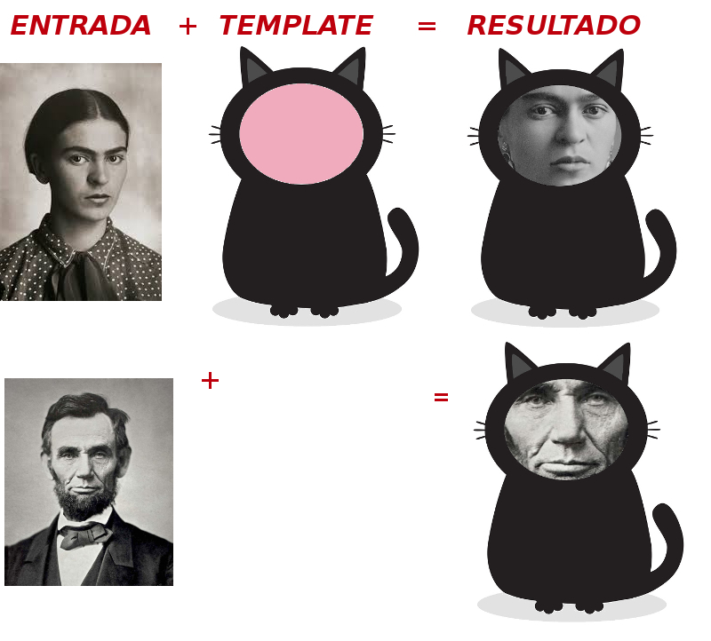

habemus-papam
=============

O mais antigo e popular *template oficial*, agora oferecido como kit-de-testes para aferição de performance de qualquer *sistema de template*.

Sistemas de template estão disponíveis em todas as linguagens de programação, desde de um simples `print "Olá $x!"` até um sofisticado sistema de publicação de fotos, textos ou revistas. As diferentes implementações podem ser comparadas usando entras e saídas padronizadas. Como não existe um "padrão ISO" para isso, estamos oferecendo um "kit padrão Habemus Papam", que se baseia no sistema formal escrito mais antigo que se tem conhecimento: o [*Habemus Papam*](https://pt.wikipedia.org/wiki/Habemus_Papam) é o *texto de template* padronizado lido repetidamente ao longo dos últimos 400 anos, a cada morte de papa.

O kit abrange todos os conceitos básicos de um *sistema de template*: lacunas (*placeholders*), loops, funções auxiliares, dicionários e modelos multilíngues. Você pode comparar a performance e/ou classificar *sistemas de template* por suas características comprovadas com o kit.

## O é um *template*? 

O kit vem munido também de [introdução didática](docs/intro.md) e [fundamentos teóricos](docs/fundamentos.md). Resumidamente, em um sistema de informação, o *template* é um "produto final com lacunas", a *entrada* é o valor que vai (integral ou adaptativamente) preencher a lacuna, e o *template engine* é a máquina que executa a operação de adaptar a entrada e preencher as lacunas. 

------

## ENTRADAS PADRONIZADAS

Todos os dados de entrada deste kit são descritos pelo [padrão FrictionLessData](https://frictionlessdata.io/specs/tabular-data-package/#specification):

  * [habemus-papam.csv](./data/habemus-papam.csv) dataset formato CSV com todos os dados de entrada. 

  * [datapackage.json](./datapackage.json) arquivo de metadados descrevend as colunas do arquivo CSV e suas fontes; [visulizar aqui](https://data.okfn.org/tools/view?url=https%3A%2F%2Fraw.githubusercontent.com%2Fspecialisterne-br%2Fhabemus-papam%2Fmaster%2Fdatapackage.json).

## REQUISITOS DO TEMPLATE
...

## EXECUTANDO O TEMPLATE SYSTEM

...
