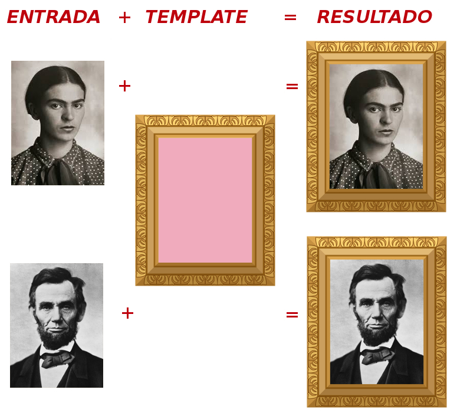

habemus-papam
=============

O mais antigo e popular *template oficial*, agora oferecido como kit-de-testes para aferição de functionalidades e performance de qualquer *sistema de template*.

Sistemas de template estão disponíveis em todas as linguagens de programação, desde de um simples `print "Olá $x!"` até um sofisticado sistema de publicação de documentos. As diferentes implementações podem ser comparadas usando entradas e saídas padronizadas. Como não existe um "padrão ISO" para isso, estamos oferecendo o "Kit Habemus Papam", que se baseia no *template* mais antigo que se tem conhecimento: o [*Habemus&nbsp;Papam*](https://pt.wikipedia.org/wiki/Habemus_Papam) é um *texto de template* padronizado, lido repetidamente ao longo dos últimos 400 anos a cada morte de papa.

O kit abrange todos os conceitos básicos de um *sistema de template*: lacunas (*placeholders*), loops, funções auxiliares, dicionários e *templates* multilíngues. Você pode comparar a performance e/ou classificar *sistemas de template* por suas características comprovadas com o kit.

## O que é um *sistema de template*?

O kit vem munido também de [introdução didática](intro.md) e [fundamentos&nbsp;teóricos](fundamentos.md). Resumidamente, em um sistema de informação, o **_template_** é um "produto final com lacunas", uma **_entrada_** é um valor que vai preencher uma das lacunas, e o **_template&nbsp;engine_** é a máquina que executa a operação de adaptar valores de entrada e preencher as lacunas. Em conjunto, entrada, engine e template, formam o *sistema de template*. Em sistemas padronizados a "linguagem do template" também faz parte da definição do sistema.

Um pouco menos abrangente, mas ainda muito útil e amplamente utilizado, um **sistema cujo _template_ é composto apenas de texto**, ou texto marcado (ex. texto HTML), é o foco do **Kit&nbsp;Habemus&nbsp;Papam**. Vejamos apenas duas entradas e um fragmento inicial do template padronizado aqui do Kit. Abaixo as lacunas de texto foram destacadas em negrito, primeiro com os dados de 1534 depois com os dados mais recentes, de 2013:

> O eminentíssimo e reverendíssimo Senhor, Senhor **Alessandro**. Cardeal da Santa Igreja Romana **Farnese**, Que se impôs o nome de **Paulo III**. &nbsp;&nbsp;&nbsp;(outubro&nbsp;de&nbsp;1534)

> O eminentíssimo e reverendíssimo Senhor, Senhor **Jorge Mario**. Cardeal da Santa Igreja Romana **Bergoglio**, Que se impôs o nome de **Francisco**. &nbsp;&nbsp;&nbsp;(março&nbsp;de&nbsp;2013)

Os fragmentos acima tem sua origem no template cujas lacunas, por exemplo `familyName`, são nomes das colunas do [arquivo CSV](https://github.com/specialisterne-br/habemus-papam/blob/master/data/habemus-papam.csv):

> O eminentíssimo e reverendíssimo Senhor, Senhor **`givenName`**. Cardeal da Santa Igreja Romana **`familyName`**, Que se impôs o nome de **`papalName_es`**.

Um exemplo completo e mais complexo de *template*, um entre diversas possíveis formas de implementação e  possíveis *linguagens de template*, é o [arquivo `complete-official.xsl`](templates/complete_official.xsl), expresso em linguagem [XSLT](https://en.wikipedia.org/wiki/XSLT).

------

## ENTRADAS PADRONIZADAS

Todos os dados de entrada deste kit são descritos pelo [padrão FrictionLessData](https://frictionlessdata.io/specs/tabular-data-package/#specification):

  * [`habemus-papam.csv`](./data/habemus-papam.csv): arquivo [formato CSV](https://pt.wikipedia.org/wiki/Comma-separated_values) com todos os dados de entrada, abrangente todos os possíveis testes deste kit.

  * [`datapackage.json`](./datapackage.json) arquivo de metadados descrevendo (em FrictionLessData) as colunas do arquivo CSV e suas fontes; [visulizar aqui](https://data.okfn.org/tools/view?url=https%3A%2F%2Fraw.githubusercontent.com%2Fspecialisterne-br%2Fhabemus-papam%2Fmaster%2Fdatapackage.json).

## REQUISITOS DO TEMPLATE
...

## EXECUTANDO O TEMPLATE SYSTEM

...

------

&#160;&#160;O conteúdo, dados e código-fonte deste repositório *git* são dedicados ao domínio público. &#160;&#160;
